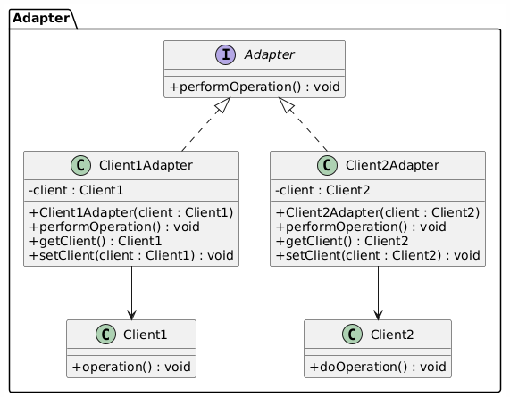

# Adapter Pattern - Java Implementation

This project demonstrates the **Adapter Pattern** in Java. The Adapter Pattern is a structural design pattern that allows incompatible interfaces to work together. In this project, we have two clients with different interfaces, and we use adapters to make their interfaces compatible with a common `Adapter` interface.

## Overview

In the project, we have the following components:

- **Client1**: Performs an operation using its `operation()` method.
- **Client2**: Performs an operation using its `doOperation()` method.
- **Adapter Interface**: Defines a standard interface `performOperation()` that both clients will adhere to using adapters.
- **Client1Adapter**: Adapts `Client1` to the `Adapter` interface.
- **Client2Adapter**: Adapts `Client2` to the `Adapter` interface.

### Key Components

1. **Adapter Interface**: The `Adapter` interface provides the `performOperation()` method, which will be implemented by both `Client1Adapter` and `Client2Adapter`.

2. **Client1**: Has its own `operation()` method that performs a specific action.

3. **Client2**: Has its own `doOperation()` method that performs a specific action.

4. **Client1Adapter**: Adapts `Client1`'s interface to the `Adapter` interface by implementing the `performOperation()` method and delegating the call to `Client1`'s `operation()` method.

5. **Client2Adapter**: Adapts `Client2`'s interface to the `Adapter` interface by implementing the `performOperation()` method and delegating the call to `Client2`'s `doOperation()` method.

### UML Diagram

Below is the UML diagram illustrating how the Adapter Pattern is implemented in this project:



The UML diagram shows the relationships between the `Adapter`, `Client1`, `Client2`, and their respective adapters, `Client1Adapter` and `Client2Adapter`.

## How to Use

Here's an example of how to use the adapters in the main function:

```java
public class MainClass {
    public static void main(String[] args) {
        // Using Client1 with the Adapter
        Client1 client1 = new Client1();
        Adapter client1Adapter = new Client1Adapter(client1);
        client1Adapter.performOperation();

        // Using Client2 with the Adapter
        Client2 client2 = new Client2();
        Adapter client2Adapter = new Client2Adapter(client2);
        client2Adapter.performOperation();
    }
}
```
Example output:

```bash
Client 1 performed the operation
Client 2 has performed the operation
```