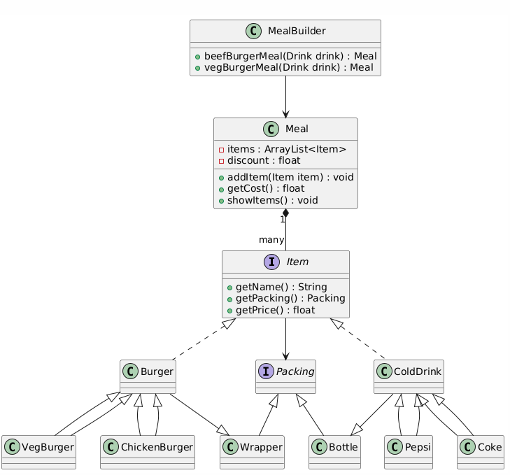

# Builder Design Pattern - Java Implementation

This project demonstrates the **Builder** design pattern, where a complex object is constructed step by step. It separates the construction of an object from its representation, allowing the same construction process to create different representations.

## Overview

In this project, we implement a meal-building system using the Builder pattern. We have various items such as burgers, cold drinks, and packaging options like wrappers and bottles. The **MealBuilder** class provides predefined meal options such as **BeefBurgerMeal** and **VegBurgerMeal**.

### Key Components

1. **MealBuilder**: Responsible for constructing different types of meals.
2. **Meal**: Represents a meal that consists of multiple items. It provides methods to add items, calculate the cost, and display the items in the meal.
3. **Item** (Interface): Defines the contract for items in the meal (e.g., Burger, ColdDrink). Each item must implement methods to get the name, packing, and price.
4. **Burger** and **ColdDrink**: Represent concrete items that implement the `Item` interface.
5. **Packing**: Represents how the items are packed (e.g., Wrapper for burgers, Bottle for drinks).

### UML Diagram

The UML diagram illustrates the relationships between different components of the Builder pattern used in this project.

## Classes

1. **MealBuilder**:
    - Methods:
        - `beefBurgerMeal(Drink drink)`: Returns a meal with a beef burger and a drink.
        - `vegBurgerMeal(Drink drink)`: Returns a meal with a veg burger and a drink.

2. **Meal**:
    - Attributes:
        - `items`: A list of items in the meal.
        - `discount`: Discount applied to the meal.
    - Methods:
        - `addItem(Item item)`: Adds an item to the meal.
        - `getCost()`: Returns the total cost of the meal.
        - `showItems()`: Displays all items in the meal.

3. **Item** (Interface):
    - Methods:
        - `getName()`: Returns the name of the item.
        - `getPacking()`: Returns the packing type.
        - `getPrice()`: Returns the price of the item.

4. **Concrete Classes**:
    - **Burger**: Represents a burger item, subclassed by **VegBurger** and **ChickenBurger**.
    - **ColdDrink**: Represents a cold drink item, subclassed by **Pepsi** and **Coke**.
    - **Packing**: Represents the packaging of the item, implemented by **Wrapper** (for burgers) and **Bottle** (for cold drinks).
