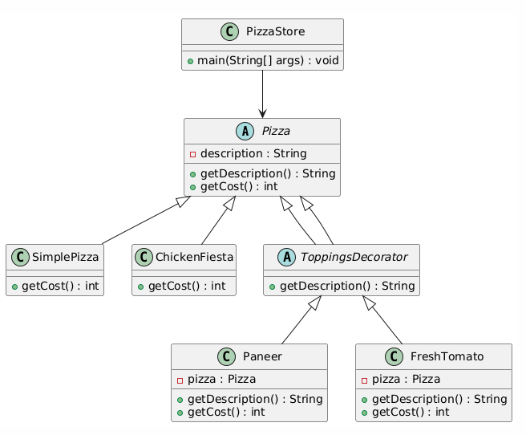

# Decorator Pattern - Java Implementation

This project demonstrates the **Decorator Pattern** using a pizza store example. The Decorator Pattern allows behavior to be added to an individual object, dynamically, without affecting the behavior of other objects from the same class. It is useful when you want to add features to objects flexibly and efficiently.

## Key Concepts

- **Core Component (`Pizza`)**: This abstract class defines the base interface for pizzas. It includes a method to retrieve the pizza's description and another to calculate its cost.

- **Concrete Components (`SimplePizza`, `ChickenFiesta`)**: These are specific implementations of the `Pizza` class, each representing a different kind of pizza.

- **Decorator (`ToppingsDecorator`)**: This abstract class extends `Pizza` and is the base class for all toppings decorators.

- **Concrete Decorators (`Paneer`, `FreshTomato`)**: These classes extend `ToppingsDecorator` and are used to dynamically add toppings to pizzas while keeping track of their description and cost.

## UML Diagram



This diagram shows the relationships between the `Pizza` base class, the concrete pizza types, and the decorators that add toppings to pizzas.

## How to Use

In the `PizzaStore` class, we demonstrate how to create pizzas and add toppings using the decorator pattern. Below is an example:

### Example

```java

// Creating a Simple Pizza
Pizza pizza = new SimplePizza();
System.out.println(pizza.getDescription()+ " Cost: "+ pizza.getCost());

// Creating a Chicken Fiesta Pizza with Fresh Tomato and Paneer Toppings
Pizza pizza2 = new ChickenFiesta();
pizza2 = new FreshTomato(pizza2);   // Adding Fresh Tomato
pizza2 = new Paneer(pizza2);        // Adding Paneer

System.out.println(pizza2.getDescription()+ " Cost: "+ pizza2.getCost());
    
```
### Example output
```text 
Simple pizza Cost: 50
Chicken Fiesta , Fresh Tomato , Paneer  Cost: 310
```
